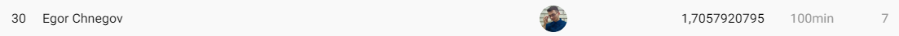

# About

My developments for [MTS ML CUP](https://ods.ai/competitions/mtsmlcup)


Final solution: all features (aggregates by user_id: price, count, cat features, encoded (w2v + node2vec) urls) + 10 cv DANets averaging



Hardware:

CPU: Intel Xeon E5-2650V2

RAM: 64 Gb DDR3

GPU: RTX 3060 (12 Gb)

# Installation
Place competition data into cameleogrey_mtsmlcup/data/raw

```
git clone https://github.com/CameleoGrey/cameleogrey_mtsmlcup.git
conda create -n mtsmlcup python=3.10
conda activate mtsmlcup
pip3 install torch==1.13.0+cu117 torchvision==0.14.0+cu117 torchaudio===0.13.0+cu117 -f https://download.pytorch.org/whl/cu117/torch_stable.html
pip install -r requirements.txt
```
If you're using Eclipse IDE with PyDev plugin, make this inside project properties:
Properties --> Resource --> Text file encoding --> Other --> UTF-8

# If you want to try scrapping / parsing features
```
pip install transformers sentence-transformers
pip install selenium
```
\+ you need to install Chrome Driver for selenium

# If you want to try graph features
```
pip install "tensorflow<2.11"
```
1) Download stellargraph package (https://github.com/stellargraph/stellargraph)
2) Place stellargraph into envs/mtsmlcup/Lib/site-packages
3) Move into stellargraph dir
4) Comment #python_requires=">=3.6.0, <3.9.0",
5) cd envs/mtsmlcup/Lib/site-packages/stellargraph
6) pip install .
